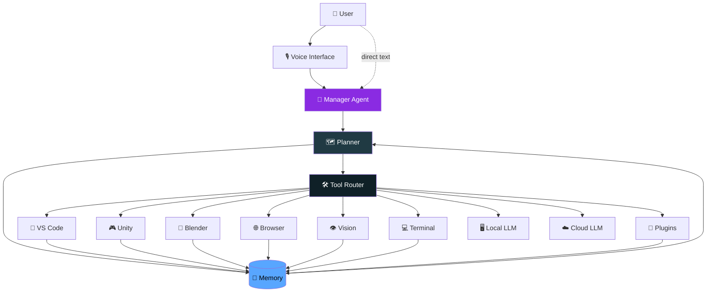
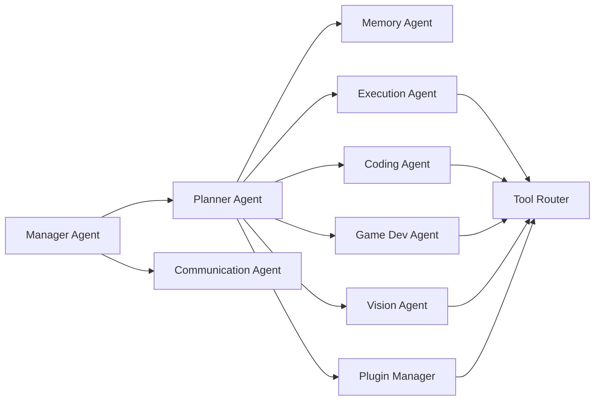
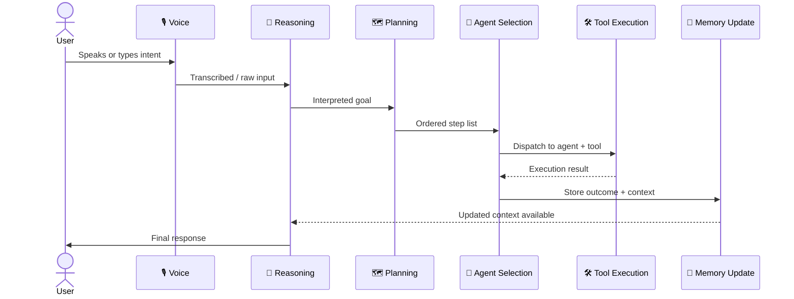
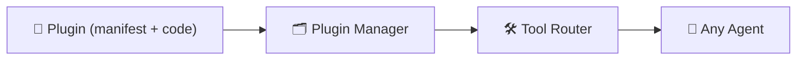

<div align="center">


### An Autonomous Local AI Operating System — for developers, creators, gamers, and engineers.


<br/>

[](https://github.com/aaravchawla/jarvis/stargazers)
[](LICENSE)
[](https://www.python.org/)
[](#-installation)
[](#-tech-stack)
[](#-system-architecture)
[](#-roadmap)
[](#-installation)
[](#-what-is-jarvis)
[](#-contributing)

<br/>


<sub>🎥 JARVIS reasoning, planning, and executing a multi-tool task end-to-end — replace with your own capture at <code>assets/demo.gif</code></sub>

</div>

<br/>

---

## 📑 Table of Contents

<details open>
<summary>Click to expand</summary>

- [What is JARVIS?](#-what-is-jarvis)
- [Features](#-features)
- [System Architecture](#-system-architecture)
- [Multi-Agent Architecture](#-multi-agent-architecture)
- [Workflow Diagram](#-workflow-diagram)
- [Project Structure](#-project-structure)
- [Tech Stack](#-tech-stack)
- [Capabilities](#-capabilities)
- [VS Code Integration](#-vs-code-integration)
- [Unity Integration](#-unity-integration)
- [Blender Integration](#-blender-integration)
- [Vision Pipeline](#-vision-pipeline)
- [Memory System](#-memory-system)
- [Plugin System](#-plugin-system)
- [Roadmap](#-roadmap)
- [Performance](#-performance)
- [Screenshots](#-screenshots)
- [Example Commands](#-example-commands)
- [Why JARVIS?](#-why-jarvis)
- [Installation](#-installation)
- [Usage](#-usage)
- [Configuration](#-configuration)
- [Contributing](#-contributing)
- [License](#-license)
- [Acknowledgements](#-acknowledgements)

</details>

---

## 🧠 What is JARVIS?

> **JARVIS is not a chatbot.** It's an autonomous AI operating system — a coordination layer that sits between you, your tools, and one or more LLMs (local or cloud), and turns natural-language intent into real, verified action across your codebase, your game engine, your 3D pipeline, and your desktop.

Where a chatbot answers questions, JARVIS **plans, executes, verifies, and remembers**. It routes work across a team of specialized agents, calls real tools (VS Code, Unity, Blender, the browser, your terminal), watches the results, and adapts — all while running as much as possible on your own hardware.

<div align="center">

| 🎯 Goal | 🧩 Approach |
|---|---|
| Reduce the gap between *intent* and *execution* | Multi-agent planning + tool routing |
| Keep your data and inference local by default | First-class local LLM support (Ollama) |
| Work across the tools you already use | Native VS Code, Unity, and Blender integrations |
| Feel like an operating system, not a plugin | Persistent memory, background agents, always-on router |

</div>

---

## ✨ Features

<div align="center">

| | | |
|:---:|:---:|:---:|
| 💻 **Autonomous Coding** | 🐞 **Self-Healing Debugging** | 🗂️ **Whole-Project Understanding** |
| Writes, refactors, and ships code | Detects, diagnoses, and fixes errors | Indexes and reasons over entire repos |
| 🧠 **Persistent Memory** | ⚙️ **Preference Learning** | 🎙️ **Voice Conversations** |
| Remembers context across sessions | Adapts to how *you* work | Natural, low-latency voice I/O |
| 👁️ **Computer Vision** | 🖥️ **Local LLM Execution** | ☁️ **Cloud LLM Execution** |
| Sees your screen or camera feed | Private, offline inference | Scales up when you need more power |
| 🔌 **Plugin Execution** | 🧩 **VS Code Integration** | 🎮 **Unity Integration** |
| Extend JARVIS with your own tools | Fixes, generates, and explains code | Scenes, scripts, prefabs, and fixes |
| 🎨 **Blender Integration** | 🌐 **Browser Automation** | 🕹️ **Game Dev Automation** |
| Models, materials, lighting, renders | Navigates and operates the web | End-to-end game feature generation |
| 🤝 **Multi-Agent Collaboration** | 🛠️ **Tool Calling** | 🗺️ **Task Planning** |
| Specialists that hand off work | Structured, reliable tool use | Breaks goals into executable steps |
| 🪞 **Self-Reasoning** | 🔁 **Autonomous Workflows** | | |
| Reflects on and corrects its own output | Runs multi-step jobs without babysitting | | |

</div>

---

## 🏗️ System Architecture

JARVIS is organized as a **central router** that takes input from the user or voice interface, passes it through a reasoning and planning core, and dispatches work to the right tool surface — all while reading from and writing to a shared memory layer.



<div align="center"><sub>Every tool surface reads context from and writes results back to the shared memory layer, so the next decision is always informed by the last one.</sub></div>

---

## 🤖 Multi-Agent Architecture

JARVIS delegates work to a team of specialized agents, coordinated by a Manager Agent. Each agent owns a narrow responsibility, which keeps behavior predictable and easy to extend.

<div align="center">

| Agent | Responsibility |
|---|---|
| 🧠 **Manager Agent** | Owns the conversation, decides which agent(s) handle a request, and merges their outputs into a single response. |
| 🗺️ **Planner Agent** | Breaks a high-level goal into an ordered sequence of executable steps and tracks progress. |
| 💾 **Memory Agent** | Reads and writes short-term, long-term, and project-scoped memory; resolves relevant context for other agents. |
| 👁️ **Vision Agent** | Processes camera or screen input for object detection, UI understanding, and visual grounding. |
| ⚙️ **Execution Agent** | Runs terminal commands, scripts, and system-level operations, and reports results back to the planner. |
| 💻 **Coding Agent** | Writes, refactors, tests, and debugs code inside VS Code–connected projects. |
| 🎮 **Game Development Agent** | Drives Unity and Blender workflows — scenes, scripts, assets, and prefabs. |
| 💬 **Communication Agent** | Handles voice input/output and natural-language clarification with the user. |
| 🔌 **Plugin Manager** | Discovers, loads, and sandboxes third-party plugins, exposing them as callable tools. |
| 🛠️ **Tool Router** | The dispatch layer that maps a planned step to the correct agent, tool, or LLM backend. |

</div>



---

## 🔁 Workflow Diagram



---

## 📁 Project Structure

```
jarvis/
├── agents/
│   ├── manager_agent.py
│   ├── planner_agent.py
│   ├── memory_agent.py
│   ├── vision_agent.py
│   ├── execution_agent.py
│   ├── coding_agent.py
│   ├── gamedev_agent.py
│   └── communication_agent.py
├── core/
│   ├── router.py              # Tool Router
│   ├── reasoning.py
│   ├── planner.py
│   └── llm_backends/
│       ├── local.py           # Ollama / local inference
│       └── cloud.py           # OpenAI / Claude / Gemini
├── integrations/
│   ├── vscode/
│   ├── unity/
│   ├── blender/
│   └── browser/
├── vision/
│   ├── capture.py
│   └── detection.py
├── memory/
│   ├── short_term.py
│   ├── long_term.py
│   ├── preferences.py
│   └── store.sqlite
├── plugins/
│   ├── plugin_manager.py
│   └── examples/
├── voice/
│   ├── stt.py
│   └── tts.py
├── config/
│   └── jarvis.config.json
├── tests/
├── docs/
├── assets/
├── requirements.txt
├── docker-compose.yml
└── README.md
```

---

## 🛠️ Tech Stack

<div align="center">

| Layer | Technologies |
|---|---|
| **Core Language** |    |
| **Backend / API** |  |
| **LLM Backends** |     |
| **Editor Integration** |  |
| **Game / 3D Engines** |   |
| **Vision** |   |
| **Storage** |  JSON |
| **DevOps** |   |

</div>

---

## ⚡ Capabilities

<div align="center">

`Coding` · `Debugging` · `Game Development` · `Automation` · `Vision` · `Voice` · `Memory` · `Planning` · `Reasoning`

</div>

---

## 🧩 VS Code Integration

<details>
<summary><b>Expand: What JARVIS can do inside VS Code</b></summary>

<br/>

- **Automatic debugging** — attaches to your run/debug session, reads stack traces and diagnostics, and proposes or applies fixes.
- **Code fixing** — resolves lint errors, type errors, and failing tests directly in the editor.
- **Project understanding** — indexes your workspace so requests like *"where is auth handled?"* resolve to real files and lines.
- **File generation** — scaffolds modules, tests, and boilerplate that match your project's existing conventions.

</details>

---

## 🎮 Unity Integration

<details>
<summary><b>Expand: What JARVIS can do inside Unity</b></summary>

<br/>

- **Scene generation** — builds out hierarchies, lighting rigs, and level layouts from a text description.
- **Scripts** — writes and wires up C# MonoBehaviours and ScriptableObjects.
- **Assets** — organizes, imports, and configures project assets.
- **Prefabs** — creates and updates reusable prefab hierarchies.
- **Bug fixing** — diagnoses console errors and null-reference issues and proposes fixes.

</details>

---

## 🎨 Blender Integration

<details>
<summary><b>Expand: What JARVIS can do inside Blender</b></summary>

<br/>

- **Model creation** — generates and edits mesh geometry from a description.
- **Materials** — builds and assigns shader/material graphs.
- **Lighting** — sets up three-point, HDRI, or scene-specific lighting rigs.
- **Animation** — creates keyframes and simple rigs/actions.
- **Rendering** — configures and kicks off render jobs.

</details>

---

## 👁️ Vision Pipeline


---

## 💾 Memory System

<div align="center">

| Memory Type | Purpose |
|---|---|
| 🕐 **Short-term** | Holds the active conversation and task context. |
| 🗄️ **Long-term** | Persists facts, decisions, and outcomes across sessions. |
| ⚙️ **Preferences** | Learns your coding style, tool choices, and workflow habits. |
| 💬 **Conversations** | Retains searchable history of prior interactions. |
| 📚 **Project Knowledge** | Maintains a structured understanding of each codebase JARVIS works in. |

</div>

---

## 🔌 Plugin System

JARVIS exposes a **plugin architecture** so the community can extend its tool surface without modifying core code:

1. A plugin registers itself with the **Plugin Manager** via a manifest describing its name, inputs, outputs, and permissions.
2. The Plugin Manager loads it into an isolated execution context and exposes it to the **Tool Router** as a callable tool.
3. When the Planner selects a step that matches the plugin's declared capability, the Tool Router dispatches to it like any built-in tool.
4. Results flow back through the same memory-update path as native integrations, so plugin output is just as "first-class" as VS Code or Unity output.



---

## 🗺️ Roadmap

<div align="center">

| Version | Focus |
|:---:|---|
| **v1** | Core agent framework, local LLM support, VS Code integration, basic memory |
| **v2** | Unity + Blender integrations, voice I/O, plugin system |
| **v3** | Vision pipeline, browser automation, multi-agent collaboration at scale |
| **Future** | Expanded plugin marketplace, cross-device sync, on-device fine-tuning |

</div>

> Roadmap items reflect current direction and are subject to change as the project evolves.

---

## 📊 Performance

<div align="center">

| Metric | Notes |
|---|---|
| **Inference speed** | Depends on local hardware and model size when using local LLM execution; cloud backends trade latency for capability. |
| **Memory usage** | Scales with the size of your project index and long-term memory store. |
| **Local execution** | Runs entirely offline when configured with a local model via Ollama. |
| **Tool latency** | Varies by integration (VS Code and terminal calls are fastest; Unity/Blender depend on the target application's responsiveness). |

</div>

<sub>⚠️ Benchmarks are hardware- and configuration-dependent. Run <code>scripts/benchmark.py</code> in your own environment for numbers specific to your setup.</sub>

---

## 🖼️ Screenshots

<div align="center">

| Dashboard | Voice |
|:---:|:---:|
|  |  |

| VS Code | Unity |
|:---:|:---:|
|  |  |

| Vision | Blender |
|:---:|:---:|
|  |  |

</div>

<sub>Replace placeholders in <code>assets/screenshots/</code> with real captures.</sub>

---

## 💬 Example Commands

```text
🗣️  "Jarvis, fix this bug."
🗣️  "Jarvis, create a Unity inventory system."
🗣️  "Jarvis, build a multiplayer FPS."
🗣️  "Jarvis, optimize this project."
🗣️  "Jarvis, generate a Blender asset."
🗣️  "Jarvis, explain this codebase."
```

---

## 🥇 Why JARVIS?

JARVIS is built around **autonomous local execution, multi-agent workflows, game development, and deep tool integration** — a different center of gravity than most AI coding assistants, which are primarily chat- or editor-centric.

<div align="center">

| Capability | JARVIS | Cursor | GitHub Copilot | Claude Code | OpenHands |
|---|:---:|:---:|:---:|:---:|:---:|
| Editor-integrated coding | ✅ | ✅ | ✅ | ✅ | ✅ |
| Local-first LLM execution | ✅ | ❌ | ❌ | ❌ | ⚠️ Partial |
| Native game-engine integration (Unity/Blender) | ✅ | ❌ | ❌ | ❌ | ❌ |
| Multi-agent orchestration | ✅ | ⚠️ Limited | ❌ | ⚠️ Limited | ✅ |
| Voice interaction | ✅ | ❌ | ❌ | ❌ | ❌ |
| Computer vision input | ✅ | ❌ | ❌ | ❌ | ❌ |
| Plugin/tool extensibility | ✅ | ⚠️ Limited | ⚠️ Limited | ✅ | ✅ |
| Autonomous multi-step workflows | ✅ | ⚠️ Limited | ❌ | ✅ | ✅ |

</div>

<sub>⚠️ Comparisons reflect general product positioning and each tool's stated capabilities as of this writing, not benchmarked head-to-head results. Feature sets change quickly — please verify against each project's own documentation before drawing conclusions.</sub>

---

## 📦 Installation

```bash
# Clone the repository
git clone https://github.com/aaravchawla/jarvis.git
cd jarvis

# Create and activate a virtual environment
python -m venv .venv
source .venv/bin/activate   # Windows: .venv\Scripts\activate

# Install dependencies
pip install -r requirements.txt

# (Optional) Pull a local model via Ollama
ollama pull llama3

# Copy and edit the config
cp config/jarvis.config.example.json config/jarvis.config.json
```

<details>
<summary><b>🐳 Docker</b></summary>

<br/>

```bash
docker compose up --build
```

</details>

---

## 🚀 Usage

```bash
# Start JARVIS
python -m jarvis.main

# Start with voice mode enabled
python -m jarvis.main --voice

# Run a single autonomous task
python -m jarvis.main --task "Refactor the auth module and add tests"
```

---

## ⚙️ Configuration

All runtime configuration lives in `config/jarvis.config.json`:

```json
{
  "llm": {
    "default_backend": "local",
    "local_model": "llama3",
    "cloud_provider": "openai",
    "cloud_model": "gpt-4.1"
  },
  "memory": {
    "store_path": "memory/store.sqlite",
    "long_term_enabled": true
  },
  "voice": {
    "enabled": false,
    "wake_word": "jarvis"
  },
  "integrations": {
    "vscode": true,
    "unity": false,
    "blender": false
  }
}
```

---

## 🤝 Contributing

Contributions are welcome and appreciated.

1. Fork the repository
2. Create a feature branch: `git checkout -b feature/my-feature`
3. Commit your changes: `git commit -m "Add my feature"`
4. Push to your branch: `git push origin feature/my-feature`
5. Open a Pull Request

Please read [`CONTRIBUTING.md`](CONTRIBUTING.md) for coding standards, commit conventions, and the review process before submitting.

---

## 📄 License

This project is licensed under the **MIT License** — see [`LICENSE`](LICENSE) for details.

---

## 🙏 Acknowledgements

- The open-source LLM and agent-tooling community, whose work makes local-first AI possible.
- [Ollama](https://ollama.com) for local model serving.
- The maintainers of VS Code, Unity, and Blender for extensible, scriptable platforms.
- Everyone who files issues, opens PRs, or stars the repo — it genuinely helps.

---

<div align="center">


**Made with ❤️ by Aarav Chawla**

</div>
